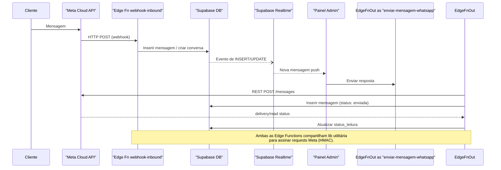
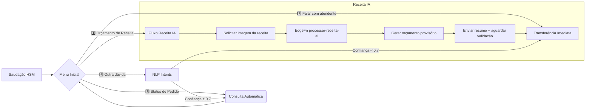
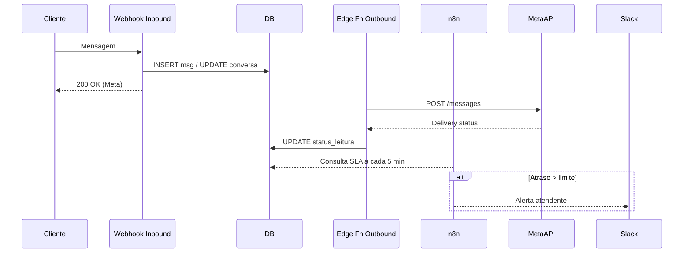

# Arquitetura de Atendimento via WhatsApp – Pharma.AI

> Documento de referência para equipe de desenvolvimento e stakeholders. Mantém
> visão completa do **estado atual** e da **arquitetura proposta** para o
> serviço de WhatsApp.

---

## 1. Visão Geral

O canal de WhatsApp será responsável por:

1. Receber e enviar mensagens entre clientes da farmácia e atendentes internos.
2. Garantir SLA de resposta, rastrear métricas de suporte e integrar-se aos
   módulos já existentes (Clientes, Vendas, Prescrições).

A estratégia foca em **implementar uma integração oficial com a Meta Cloud
API**, substituir pooling por **Supabase Realtime**, além de adicionar
**Webhooks de entrada**, **distribuição automática de conversas** e
monitoramento proativo de SLA.

---

## 2. Estado Atual (2025-06)

### 2.1 Banco de Dados

| Tabela                  | Descrição                              | Campos-chave                                                                                                                                            |
| ----------------------- | -------------------------------------- | ------------------------------------------------------------------------------------------------------------------------------------------------------- |
| `conversas_atendimento` | Metadados da conversa                  | `id`, `cliente_id`, `cliente_nome`, `cliente_telefone`, `status`, `prioridade`, `atendente_id`, `ultima_mensagem_at`, `created_at`, `updated_at`        |
| `mensagens_atendimento` | Histórico de mensagens                 | `id`, `conversa_id`, `remetente_tipo`, `remetente_id`, `conteudo`, `tipo_mensagem`, `whatsapp_message_id`, `status_leitura`, `enviada_em`, `created_at` |
| `templates_resposta`    | Respostas prontas (HSM/meta templates) | `id`, `nome`, `categoria`, `conteudo`, `variaveis`, `ativo`, `uso_automatico`                                                                           |

_Políticas RLS_: habilitadas em todas as tabelas (necessita ajuste futuro para
escopo de atendente).

### 2.2 Funções SQL / RPC

- `buscar_conversas_whatsapp(p_status, p_busca, p_limit, p_offset)` –
  paginate/filter conversas.

### 2.3 Edge Functions Ativas

| Function                   | Objetivo                                                                         | Status                |
| -------------------------- | -------------------------------------------------------------------------------- | --------------------- |
| `enviar-mensagem-whatsapp` | Cria conversa quando necessário, grava mensagem e **simula** envio para WhatsApp | ✅ em produção (mock) |

### 2.4 Front-end

- **Hook** `useWhatsApp` (React Query):
  - `useConversas` – polling 30 s.
  - `useMensagens` – polling 5 s.
  - `useTemplates` & `useMetricas`.
- **Página** `src/pages/admin/whatsapp/index.tsx` – painel de atendimento
  (listar, filtrar, enviar mensagens, usar templates).

### 2.5 Lacunas Identificadas

1. Envio real via API oficial ainda **não** implementado
   (`whatsapp_status: 'simulado'`).
2. Ausência de **webhook inbound**: recebimento de mensagens depende de polling
   externo (n8n/cron).
3. Sem **Realtime channels** → demora no desktop dos atendentes.
4. Falta de **fila/distribuição automática** e **monitoramento de SLA (24 h)**.
5. Eventos de entrega/leitura da Meta não são gravados.

---

## 3. Arquitetura Proposta

### 3.1 Objetivos

1. Comunicação em **tempo real** (<1 s) com clientes.
2. Cumprir políticas da Meta (janelas de 24 h, templates aprovados).
3. Escalabilidade horizontal e segurança (RLS, least privilege).
4. Métricas robustas (FRT, ART, CSAT) para melhoria contínua.

### 3.2 Diagrama de Fluxo (Mermaid)



### 3.3 Componentes

1. **Edge Function `webhook-whatsapp-inbound`**
   - Recebe POST da Meta.
   - Valida assinatura (HMAC SHA-256 + token).
   - Cria/atualiza `conversas_atendimento` e insere mensagem em
     `mensagens_atendimento`.
   - Publica evento Realtime (`supabase.realtime.channel('whatsapp')`).
2. **Edge Function `enviar-mensagem-whatsapp` (upgrade)**
   - Implementa chamada real
     `https://graph.facebook.com/v19.0/{{phone-id}}/messages`.
   - Mapper de erros → status `erro_envio`.
3. **Realtime Channels**
   - `whatsapp_conversas`, `whatsapp_mensagens`.
   - Front-end subscribe → exibe toast "Nova mensagem".
4. **Distribuidor de Conversas (`atribuir_conversa`)**
   - Edge RPC ou função Postgres (preferível) para distribuir round-robin ou por
     carga.
   - Atualiza coluna `atendente_id`.
5. **Monitor SLA (`monitorar_sla_conversas`)**
   - Job programado (cron Edge) verifica janelas 24 h & FRT/ART.
   - Gera alertas via email ou canal Slack.
6. **Eventos de Entrega**
   - Tabela `eventos_whatsapp` grava `delivered`, `read`.
   - Hook DB atualiza `status_leitura` em `mensagens_atendimento`.

### 3.4 Novas Tabelas / Alterações

| Tabela                          | Campos Principais                                        | Observações                |
| ------------------------------- | -------------------------------------------------------- | -------------------------- |
| `eventos_whatsapp`              | `id`, `mensagem_id`, `evento`, `timestamp`               | Index por `mensagem_id`    |
| `fila_conversas`                | `id`, `conversa_id`, `status`, `posicao`, `atribulada_a` | Para distribuição flexível |
| Alterar `conversas_atendimento` | + `sla_expira_em`, `canal` (whatsapp)                    | Index por `sla_expira_em`  |

_RLS_: atualizar policies para permitir que:

- atendente veja/converse apenas se `atendente_id = auth.uid()` **ou**
  `status = 'aberto'`.
- supervisores → role claim `nivel_acesso = supervisor`.

### 3.5 Métricas & KPIs

| Métrica                           | Descrição                                        | Cálculo                             |
| --------------------------------- | ------------------------------------------------ | ----------------------------------- |
| **FRT** (First Response Time)     | Tempo do recebimento à primeira resposta enviada | avg(timestamp_resp − timestamp_cli) |
| **ART** (Average Resolution Time) | Duração da conversa até status `resolvido`       | avg(resolvido_em − created_at)      |
| **Taxa de Resolução**             | % conversas resolvidas / totais                  | resolvidas ÷ total                  |
| **CSAT**                          | Satisfação via emoji ou pontuação                | via template "Como avalia?"         |

### 3.6 Fluxo Híbrido IA + Atendente

#### 3.6.1 Princípios-guia

1. **Agilidade**: IA trata solicitações repetitivas e de baixa complexidade;
   atendente foca nas atividades que exigem julgamento farmacêutico.
2. **Hand-off claro**: cada transferência IA → humano registra horário,
   atendente responsável e motivo (baixa confiança, pedido do cliente, etc.).
3. **Livre escolha do cliente**: menu "Falar com atendente" disponível o tempo
   todo; IA identifica palavra-chave de desistência ("humano", "atendente").
4. **Validação regulatória**: nenhuma orientação terapêutica ou posologia é
   enviada ao cliente sem confirmação de um farmacêutico.
5. **Transparência**: IA se identifica como assistente virtual e avisa quando
   transfere.

#### 3.6.2 Macrofluxo Operacional



#### 3.6.3 Detalhamento de Etapas

| Etapa               | Responsável     | Descrição                                                                              | Status Conversa        |
| ------------------- | --------------- | -------------------------------------------------------------------------------------- | ---------------------- |
| Saudação + Menu     | IA              | Envia template HSM aprovado com botões rápidos                                         | `aberto`               |
| Triagem NLP         | IA              | Classifica intenção, define confiança                                                  | `aberto`               |
| Orçamento Receita   | IA              | Extrai dados, calcula preço estimado, cria registro `orcamentos` (status `provisorio`) | `aguardando_validacao` |
| Validação Orçamento | Atendente       | Confere estoque, prazo, regulações; atualiza `orcamentos.status = validado`            | `em_atendimento`       |
| Resposta Final      | IA ou Atendente | Envia orçamento final; opcional link de pagamento automático                           | `resolvido`            |
| Pesquisa CSAT       | IA              | Disparada 15 min após `resolvido`                                                      | —                      |

#### 3.6.4 Novas Tabelas Relacionadas

| Tabela       | Campos                                                                                                     | Observações                                                      |
| ------------ | ---------------------------------------------------------------------------------------------------------- | ---------------------------------------------------------------- |
| `orcamentos` | `id`, `conversa_id`, `json_receita`, `valor_estimado`, `valor_final`, `status`, `created_at`, `updated_at` | FK em `conversa_id`; status: `provisorio`, `validado`, `enviado` |

#### 3.6.5 Edge Functions Adicionais

1. `processar-receita-ai` – recebe imagem, utiliza serviço OCR + LLM, retorna
   JSON da fórmula.
2. `validar-orcamento` – chamada pelo painel do atendente para alterar
   valores/status.
3. `co-pilot-sugestoes` – opcional: gera respostas sugeridas ao atendente em
   modo sombra.

#### 3.6.6 Indicadores Específicos de IA

| Métrica                     | Descrição                                                  |
| --------------------------- | ---------------------------------------------------------- |
| **FRT-IA**                  | Tempo até primeira resposta automática (meta: < 5 s)       |
| **Taxa de Desistência IA**  | % clientes que pedem humano após interação inicial         |
| **% Orçamentos sem ajuste** | Orçamentos aprovados pelos atendentes sem mudança (> 80 %) |

#### 3.6.7 Boas Práticas

- **Fallback**: se IA falhar três vezes consecutivas → hand-off automático.
- **Privacidade**: imagens de receita armazenadas em bucket privado com RLS,
  expirando após 90 dias.
- **Auditoria de Prompt**: logs completos de entrada/saída armazenados na tabela
  `ai_logs` para revisão.
- **Treinamento Contínuo**: atendente marca 👍/👎 nas sugestões; dados alimentam
  fine-tuning trimestral.

#### 3.6.8 Cenário Alternativo (Modo Sombra)

No lançamento inicial, IA pode operar em _modo sombra_: gera respostas e
orçamentos apenas como sugestões internas. Atendente decide enviar ou editar.
Após confiança > 90 % em métricas-chave, habilita envio direto.

### 3.7 Integração n8n × Sistema

#### 3.7.1 Critérios de Decisão

1. **Latência** – Respostas que o cliente vê devem acontecer em < 1 s
   (Edge/Sistema).
2. **Consistência** – Operações que afetam o banco e dependem de RLS/Triggers
   (Edge/Sistema).
3. **Tolerância a atraso** – Rotinas que podem esperar minutos (n8n).
4. **Integrações externas** – E-mail, Slack, Google Sheets, etc. (n8n tem
   conectores prontos).
5. **Manutenção** – Código crítico versionado em Git; automações periféricas
   podem ser visuais.

#### 3.7.2 Mapa de Responsabilidades

| Componente / Tarefa                 | Implementação                                       | Motivo principal                         |
| ----------------------------------- | --------------------------------------------------- | ---------------------------------------- |
| Webhook **inbound** WhatsApp        | Edge Function `webhook-whatsapp-inbound`            | SLA < 10 s + transação DB                |
| Envio de mensagens **outbound**     | Edge Function `enviar-mensagem-whatsapp`            | Baixa latência, mesma lógica/validação   |
| Distribuição / Fila de conversas    | RPC `atribuir_conversa` + Trigger Postgres          | Mantém integridade e RLS                 |
| Processar receita (OCR + LLM)       | Edge se ≤10 s; caso contrário Worker/Queue separado | Pode ser pesado; separação se necessário |
| Alertas de SLA (e-mail/Slack)       | Fluxo n8n                                           | Não crítico para cliente; fácil integrar |
| Relatórios diários / backup buckets | Fluxo n8n (cron)                                    | Automação periódica visual               |
| Pesquisa CSAT após 15 min           | Fluxo n8n (agendamento)                             | Disparo assíncrono sem impacto           |

#### 3.7.3 Fluxo de Dados Resumido



#### 3.7.4 Passo a Passo de Implantação

1. **Sprint 1** – Deploy Edge Functions críticas + variáveis de ambiente (URL e
   Token Meta).
2. **Sprint 2** – Subir instância n8n (Docker Compose) com acesso restrito à
   Service Role Key **somente** via Webhook privado.
3. **Sprint 3** – Configurar fluxos: alerta SLA, disparo CSAT, backup diário.
4. **Governança** – Exportar workflows n8n para JSON e versionar em repositório
   `infra/automacoes-n8n`.
5. **Monitoramento** – Habilitar logs de execução n8n + métricas Edge em
   Supabase.

#### 3.7.5 Workflows n8n Detalhados

##### A. Workflow "Alerta SLA"

1. **Cron** – Executa a cada 5 min.
2. **Supabase – Execute SQL** – Consulta:
   ```sql
   SELECT id, cliente_nome, sla_expira_em
   FROM conversas_atendimento
   WHERE status = 'aguardando_cliente'
     AND sla_expira_em < now();
   ```
3. **If (items.length > 0)** – Verifica se há atrasos.
4. **Slack – Post Message** – Envia lista de IDs atrasados para canal
   #suporte-farmacia.

##### B. Workflow "Pesquisa CSAT"

1. **Webhook (POST /csat-trigger)** – Chamado pela Edge Function quando `status`
   muda para `resolvido`.
2. **Wait** – Aguardar 15 min.
3. **Supabase – Select** – Busca telefone e nome do cliente.
4. **HTTP Request** – `POST /messages` (Meta API) com template CSAT ("Como você
   avalia nosso atendimento?").
5. **Supabase – Insert** – Grava tentativa de envio em tabela
   `eventos_whatsapp`.

##### C. Workflow "Backup Receitas"

1. **Cron** – Diariamente 02:00.
2. **Supabase Storage – List Objects** – Bucket `receitas`.
3. **SplitInBatches** – Processa 50 arquivos por vez.
4. **HTTP Request** – Baixa cada arquivo (Download Binary).
5. **AWS S3 – Upload** – Envia para Glacier, pasta
   `backup_receitas/YYYY-MM-DD/`.
6. **E-mail – Send** – Reporta total de arquivos enviados e falhas.

> Esses workflows devem ser exportados em JSON e armazenados em
> `infra/automacoes-n8n` para versionamento.

---

## 4. Roadmap Sugerido

| Sprint | Entregas                                                                                                          | Responsáveis    |
| ------ | ----------------------------------------------------------------------------------------------------------------- | --------------- |
| 1      | Configurar credenciais Meta, criar `webhook-whatsapp-inbound`, atualizar `enviar-mensagem-whatsapp` p/ envio real | Backend         |
| 2      | Realtime channels + ajuste RLS                                                                                    | Backend / Front |
| 3      | Painel SLA, distribuição automática (`atribuir_conversa`)                                                         | Backend / UX    |
| 4      | Eventos de entrega/leitura, dashboard de métricas                                                                 | Backend / Data  |
| 5      | CSAT + autosserviço (menu, status pedido)                                                                         | IA / Front      |

---

## 5. Segurança & Compliance

- **Auth**: Supabase Auth + JWT; Edge Functions utilizando **Service Role**
  apenas onde estritamente necessário.
- **Criptografia**: HTTPS obrigatório; Webhook assinado.
- **Auditoria**: triggers de histórico em conversas/mensagens.
- **LGPD**: DPO informado; clientes podem solicitar exclusão de dados.

---

## 6. Dependências Externas

| Serviço        | Uso                       | Plano              |
| -------------- | ------------------------- | ------------------ |
| Meta Cloud API | Mensagens WhatsApp        | Standard (5 €/mil) |
| Supabase       | DB + Realtime + Edge      | Pro                |
| n8n (opcional) | Fluxos de fallback/alerta | Self-host          |

---

## 7. Glossário

- **HSM** – Highly Structured Message (Template aprovado).
- **FRT/ART/CSAT** – Métricas de suporte.
- **BSP** – Business Solution Provider.

---

> Atualizado em: 24/06/2025

---

**Autores:** Equipe Pharma.AI – Comunicação Omnicanal
