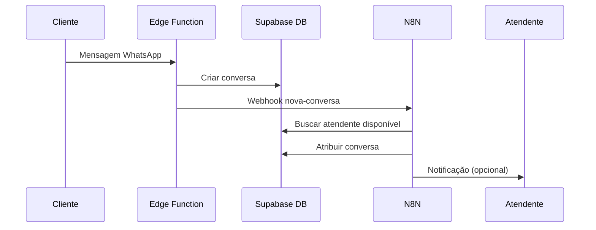
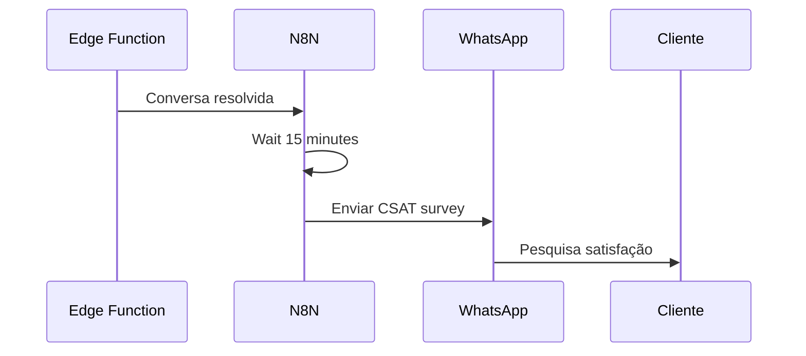

# Integração N8N × Edge Functions Pharma.AI

Documentação técnica da integração entre workflows n8n e Edge Functions do
Supabase.

## 🔄 Arquitetura Híbrida

### Divisão de Responsabilidades

| Componente         | Responsabilidade          | Latência | Justificativa                    |
| ------------------ | ------------------------- | -------- | -------------------------------- |
| **Edge Functions** | Operações críticas        | < 1s     | RLS, transações, response time   |
| **N8N Workflows**  | Automações complementares | Minutos  | Integrações, relatórios, alertas |

## 📡 Pontos de Integração

### 1. Webhook Triggers (Edge → N8N)

#### A. Nova Conversa Criada

**Edge Function:** `webhook-whatsapp-inbound`\
**N8N Workflow:** `distribuicao-conversas`

```typescript
// No final da Edge Function webhook-whatsapp-inbound
if (conversaNovaId) {
    // Chamar webhook n8n para distribuição
    await fetch(`${N8N_WEBHOOK_URL}/nova-conversa`, {
        method: "POST",
        headers: { "Content-Type": "application/json" },
        body: JSON.stringify({
            conversa_id: conversaNovaId,
            cliente_nome: clienteNome,
            cliente_telefone: clienteTelefone,
            timestamp: new Date().toISOString(),
        }),
    });
}
```

#### B. Conversa Resolvida

**Edge Function:** `enviar-mensagem-whatsapp` (status update)\
**N8N Workflow:** `pesquisa-csat-automatica`

```typescript
// Quando status muda para 'resolvido'
if (novoStatus === "resolvido") {
    await fetch(`${N8N_WEBHOOK_URL}/csat-trigger`, {
        method: "POST",
        headers: { "Content-Type": "application/json" },
        body: JSON.stringify({
            conversa_id: conversaId,
            cliente_nome: clienteNome,
            cliente_telefone: clienteTelefone,
            atendente_id: atendenteId,
        }),
    });
}
```

### 2. Database Triggers (DB → N8N)

#### A. SLA Expirado

**Database Function:** `buscar_conversas_sla_expirado`\
**N8N Workflow:** `alerta-sla-atendimento`

```sql
-- Função chamada pelo cron n8n
CREATE OR REPLACE FUNCTION buscar_conversas_sla_expirado()
RETURNS TABLE (
  id UUID,
  cliente_nome TEXT,
  cliente_telefone TEXT,
  sla_expira_em TIMESTAMPTZ,
  atendente_id UUID
)
LANGUAGE sql
SECURITY DEFINER
AS $$
  SELECT 
    ca.id,
    ca.cliente_nome,
    ca.cliente_telefone,
    ca.sla_expira_em,
    ca.atendente_id
  FROM conversas_atendimento ca
  WHERE ca.status IN ('aguardando_cliente', 'em_andamento')
    AND ca.sla_expira_em < NOW()
    AND ca.sla_expira_em > NOW() - INTERVAL '1 hour' -- Evitar spam
  ORDER BY ca.sla_expira_em ASC;
$$;
```

### 3. Storage Operations (Edge → N8N)

#### A. Backup de Receitas

**Supabase Storage:** bucket `receitas`\
**N8N Workflow:** `backup-receitas-diario`

```typescript
// N8N lista arquivos via Storage API
const response = await fetch(
    "https://hjwebmpvaaeogbfqxwub.supabase.co/storage/v1/object/list/receitas",
    {
        method: "POST",
        headers: {
            "Authorization": `Bearer ${serviceRoleKey}`,
            "Content-Type": "application/json",
        },
        body: JSON.stringify({
            limit: 1000,
            offset: 0,
        }),
    },
);
```

## 🔧 Configuração das Integrações

### 1. Variáveis de Ambiente (Edge Functions)

```typescript
// Em todas as Edge Functions relevantes
const N8N_WEBHOOK_URL = Deno.env.get("N8N_WEBHOOK_URL");
const N8N_AUTH_TOKEN = Deno.env.get("N8N_AUTH_TOKEN");

// Função helper para chamar n8n
async function triggerN8nWorkflow(endpoint: string, data: any) {
    if (!N8N_WEBHOOK_URL) return;

    try {
        await fetch(`${N8N_WEBHOOK_URL}${endpoint}`, {
            method: "POST",
            headers: {
                "Content-Type": "application/json",
                "Authorization": `Bearer ${N8N_AUTH_TOKEN}`,
            },
            body: JSON.stringify(data),
        });
    } catch (error) {
        console.error("N8N trigger failed:", error);
        // Falha silenciosa - não bloquear operação principal
    }
}
```

### 2. Webhooks N8N

Configurar no n8n as seguintes URLs:

| Endpoint         | Workflow               | Método |
| ---------------- | ---------------------- | ------ |
| `/nova-conversa` | Distribuição Conversas | POST   |
| `/csat-trigger`  | CSAT Automático        | POST   |

### 3. Database Functions Necessárias

```sql
-- Função para buscar atendente disponível
CREATE OR REPLACE FUNCTION buscar_atendente_disponivel()
RETURNS TABLE (atendente_id UUID, nome TEXT)
LANGUAGE sql
SECURITY DEFINER
AS $$
  SELECT u.id, u.nome
  FROM usuarios u
  WHERE u.perfil = 'atendente'
    AND u.ativo = true
  ORDER BY (
    SELECT COUNT(*) 
    FROM conversas_atendimento ca 
    WHERE ca.atendente_id = u.id 
      AND ca.status IN ('aguardando_cliente', 'em_andamento')
  ) ASC
  LIMIT 1;
$$;

-- Função para atribuir conversa
CREATE OR REPLACE FUNCTION atribuir_conversa(
  p_conversa_id UUID,
  p_atendente_id UUID
)
RETURNS BOOLEAN
LANGUAGE plpgsql
SECURITY DEFINER
AS $$
BEGIN
  UPDATE conversas_atendimento
  SET 
    atendente_id = p_atendente_id,
    status = 'em_andamento',
    sla_expira_em = NOW() + INTERVAL '1 hour',
    updated_at = NOW()
  WHERE id = p_conversa_id;
  
  RETURN FOUND;
END;
$$;

-- Funções para métricas
CREATE OR REPLACE FUNCTION calcular_frt_semanal()
RETURNS TABLE (frt_media NUMERIC)
LANGUAGE sql
SECURITY DEFINER
AS $$
  SELECT 
    AVG(EXTRACT(EPOCH FROM (primeira_resposta_em - created_at))/60)::NUMERIC(10,2) as frt_media
  FROM conversas_atendimento
  WHERE created_at >= NOW() - INTERVAL '7 days'
    AND primeira_resposta_em IS NOT NULL;
$$;

CREATE OR REPLACE FUNCTION calcular_art_semanal()
RETURNS TABLE (art_media NUMERIC)
LANGUAGE sql
SECURITY DEFINER
AS $$
  SELECT 
    AVG(EXTRACT(EPOCH FROM (resolvido_em - created_at))/60)::NUMERIC(10,2) as art_media
  FROM conversas_atendimento
  WHERE created_at >= NOW() - INTERVAL '7 days'
    AND status = 'resolvido'
    AND resolvido_em IS NOT NULL;
$$;
```

## 🔄 Fluxos de Dados

### 1. Fluxo Nova Conversa



### 2. Fluxo CSAT



## 🛡️ Tratamento de Erros

### 1. Fallbacks N8N

- Se n8n falhar, Edge Functions continuam funcionando
- Operações críticas nunca dependem do n8n
- Logs de falha para monitoramento

### 2. Retry Logic

```typescript
async function triggerN8nWithRetry(
    endpoint: string,
    data: any,
    maxRetries = 3,
) {
    for (let i = 0; i < maxRetries; i++) {
        try {
            await triggerN8nWorkflow(endpoint, data);
            return;
        } catch (error) {
            if (i === maxRetries - 1) {
                console.error(
                    `N8N trigger failed after ${maxRetries} attempts:`,
                    error,
                );
            }
            await new Promise((resolve) => setTimeout(resolve, 1000 * (i + 1))); // Backoff
        }
    }
}
```

## 📊 Monitoramento

### 1. Métricas N8N

- Execuções por workflow
- Taxa de sucesso/falha
- Tempo de execução

### 2. Logs Estruturados

```typescript
// Nas Edge Functions
console.log("N8N_TRIGGER", {
    workflow: "nova-conversa",
    conversa_id: conversaId,
    success: true,
    timestamp: new Date().toISOString(),
});
```

### 3. Alertas de Falha

- N8N monitora próprias execuções
- Slack alerts para falhas críticas
- Email reports para administradores

## 🔒 Segurança

### 1. Autenticação

- N8N usa Service Role Key (limitado)
- Webhooks com token de autenticação
- HTTPS obrigatório

### 2. Rate Limiting

- Limite de calls por minuto
- Proteção contra spam
- Circuit breaker pattern

### 3. Validação de Dados

```typescript
// Validar payload antes de processar
function validateWebhookPayload(data: any): boolean {
    return (
        data &&
        typeof data.conversa_id === "string" &&
        typeof data.cliente_nome === "string" &&
        typeof data.cliente_telefone === "string"
    );
}
```

---

**Última atualização:** Janeiro 2025\
**Versão:** 1.0.0
